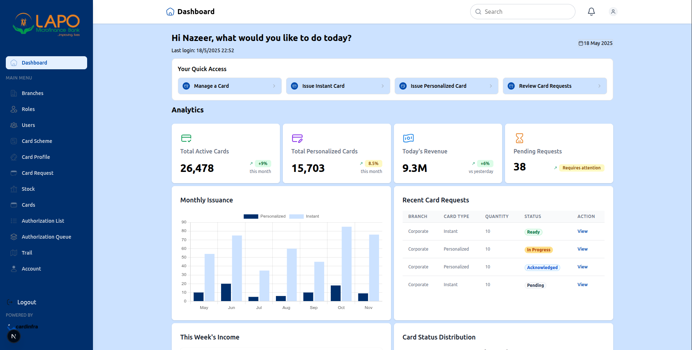

# LAPO Dashboard


A modern dashboard application for financial analytics and card management.



### Figma link: https://www.figma.com/design/kxTFknUuQ1J0xiMZKoFmiQ/LAPO-Web-App?node-id=112-6992&t=p1g4OQNcg3Tj39E2-0

### Deployment link:

## ✨ Features

- Interactive data visualization with **Chart.js**
- Responsive UI built with **Tailwind CSS**
- Next.js App Router architecture
- Real-time analytics display
- Card management interface

## 🛠️ Tech Stack

- Framework: [Next.js 15](https://nextjs.org/)
- UI: [Tailwind CSS](https://tailwindcss.com/)
- Charts: [Chart.js](https://www.chartjs.org/) + [react-chartjs-2](https://react-chartjs-2.js.org/)
- Linting: ESLint

## 🚀 Getting Started

### Prerequisites

- Node.js 18+
- npm 9+

### Installation

1. Clone the repository

```bash
git clone https://github.com/your-repo/lapo-dashboard.git
```

2. Install dependencies
   `npm install`

3. Development
   `npm install`

4. Production Build
   `npm run build && npm start`

5. Linting
   `npm run lint`

### 📂 Project Structure

/lapo-dashboard
├── app/ # Next.js app router
├── components/ # Reusable components
├── public/ # Static assets
├── styles/ # Global CSS
├── package.json
└── tailwind.config.js # Tailwind configuration

### 📊 Chart Components

1. Bar Charts - Monthly issuance analytics

2. Line Charts - Income trends

3. Pie Charts - Status distributions

### 🤝 Contributing

Pull requests are welcome. For major changes, please open an issue first.
